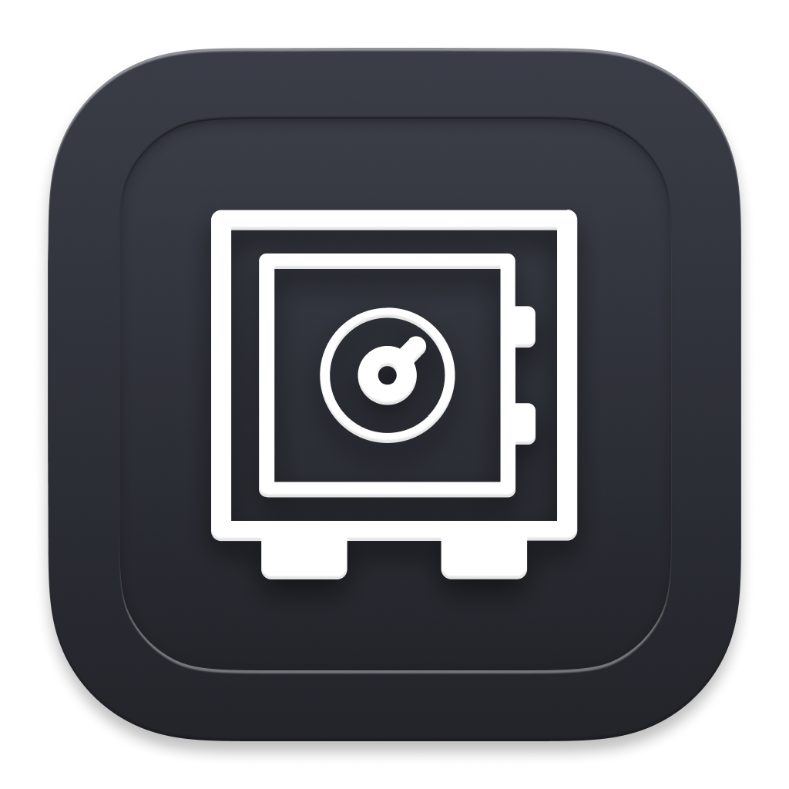
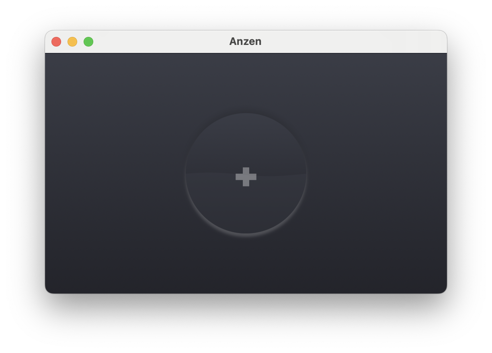

  

# Anzen (安全)
### A small macOS encyption utility for [SwiftUI Series](https://www.swiftuiseries.com/).

Drop your file onto the window and set a password.

  

The utility uses [Apple Encrypted Archive API](https://developer.apple.com/documentation/applearchive/encrypting_and_decrypting_a_single_file)

Icons by [Morphix Design Studio](https://morphix.si)

TODO:
- Better error handling with descriptive messages
- Handle folders
- Warn and handle overwritting
- Option to select different destination folder