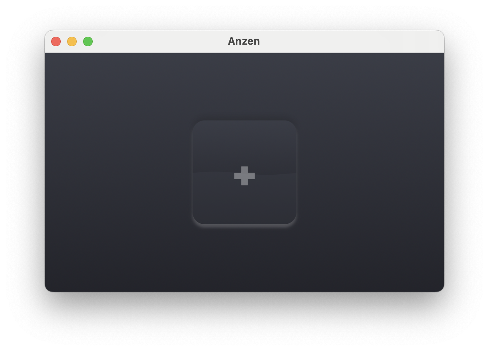

  

# Anzen (安全/Hide)
### A small macOS encyption/decryption utility for [SwiftUI Series](https://www.swiftuiseries.com/).

**Encrypt:** Drop your file onto the rectangle on the window and set a password.

**Decrypt:** Drop your file with `.encrypt` extension onto the rectangle on the window and give the password you set earlier.

  

The utility uses [Apple Encrypted Archive API](https://developer.apple.com/documentation/applearchive/encrypting_and_decrypting_a_single_file).

Icon by [Morphix Design Studio](https://morphix.si)

**TODO:**
- Better error handling with descriptive messages
- Handle folders
- Warn and handle overwritting
- Option to select different destination folder
- Option to select different encryption level